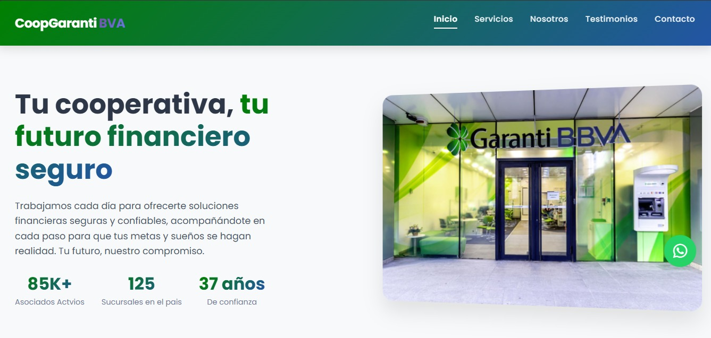

# CoopGarantiBVA - Página Web Institucional


## Descripción

CoopGarantiBVA es una página web institucional diseñada para una cooperativa financiera. La página muestra información sobre:

- Servicios financieros ofrecidos.
- Historia, misión y visión de la cooperativa.
- Testimonios de asociados.
- Información de contacto con formulario.

> Nota: El formulario de contacto está diseñado en el front-end, pero **no envía mensajes** ya que no se ha implementado un back-end. Solo sirve como demostración visual.

## Características

- Diseño **responsive** adaptable a dispositivos móviles, tabletas y escritorio.
- Navegación clara y moderna con menú fijo.
- Sección de servicios con iconos y descripciones.
- Galería de imágenes y testimonios de asociados.
- Integración con redes sociales y WhatsApp.

## Tecnologías utilizadas

- HTML5
- CSS3
- Bootstrap 5
- Font Awesome (Iconos)
- Google Fonts (Tipografía)

## Instalación / Uso

1. Clona el repositorio:

```bash

git clone https://github.com/TU_USUARIO/CoopGarantiBVA.git

2. Abre el archivo index.html en tu navegador.

3. Navega por las secciones y explora el diseño responsivo.





## 📄 Licencia

Este proyecto está bajo la **Licencia MIT**.  
Consulta el archivo [LICENSE](./LICENSE) para más detalles.  